# VQEzy: An Open-Source Dataset for Parameter Initialization in VQEs

## Overview

 `VQEzy` is a large scale dataset, collecting 12,110 instances across 3 domains and 7 application tasks. Each instance contains the full description of the target VQE Hamiltonian, full optimal trajectory and the optimal parameters after optimization. `VQEzy` is collected via the process shown in

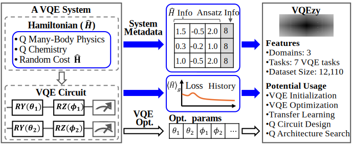.

`VQEzy` highlights the contributions below

* `VQEzy` is the first large dataset spanning large scale and various VQE applications, compared to previous work with less than 500 instances
* `VQEzy` records comprehensive VQE optimization data, each instances contains rich attributes: target hamiltonians, ansatz architecture, optimal parameters and full optimization trajectory.

`VQEzy` can be used for

* VQE initialization and optimization.
* Transfer learning across VQE tasks
* VQE architecture design and research.

We'll continue to refine and expand this resource to support future research in VQE optimization.

## Dataset Characterization

The statistics of `VQEzy` is as the table below

|        Application        | Task       | Hamiltonian                                                                     | Ansatz   | Hamiltonian Parameters              | # Params | # Qubits | Feature Dim. | # Instances |
| :-----------------------: | ---------- | ------------------------------------------------------------------------------- | -------- | ----------------------------------- | -------- | -------- | ------------ | ----------- |
| Quantum Many-Body Physics | 1D_XYZ     | Eq. (Heisenberg XYZ)                                                            | Fig. (a) | Coupling constants (J₁, J₂, J₃)  | 8        | 4        | 1×8         | 2000        |
|                          |            |                                                                                 |          |                                     | 24       | 12       | 1×24        | 2000        |
|                          | 1D_FH      | Eq. (1D FH)                                                                     | Fig. (a) | Hopping*t* and interaction *U*  | 8        | 4        | 1×8         | 1000        |
|                          |            |                                                                                 |          |                                     | 12       | 6        | 1×12        | 1000        |
|                          |            |                                                                                 |          |                                     | 16       | 8        | 1×16        | 1000        |
|                          | 2D_TFI     | Eq. (2D TFI)                                                                    | Fig. (a) | Coupling*j* and field strength μ | 16       | 8        | 1×16        | 1000        |
|     Quantum Chemistry     | H₂        | [Utkarsh (2023)](https://pennylane.ai/datasets/collection/qchem)                   | Fig. (b) | H–H bond length                    | 24       | 4        | 1×24        | 150         |
|                          | HeH⁺      | [Utkarsh (2023)](https://pennylane.ai/datasets/collection/qchem)                   | Fig. (b) | He–H bond length                   | 24       | 4        | 1×24        | 1000        |
|                          | NH₃       | [Utkarsh (2023)](https://pennylane.ai/datasets/collection/qchem)                   | Fig. (b) | N–H bond length                    | 336      | 16       | 1×336       | 160         |
|        Random VQE        | Random_VQE | [Li (2023, QASMBench)](https://github.com/pnnl/QASMBench/blob/master/small/vqe.py) | Fig. (c) | Pauli string coefficients           | 48       | 4        | 1×48        | 2800        |

Where the Hamiltonians are defined by

Heisenberg XYZ :

$$
\hat{H} = \sum_{i=0}^3 \Big( J_1 X_i X_{i+1} + J_2 Y_i Y_{i+1} + J_3 Z_i Z_{i+1} \Big)
$$

1D FH:

$$
\hat{H} = -t \sum_{i=0}^{n-1} \big( \hat{c}^\dagger_i \hat{c}_{i+1} + \hat{c}_{i+1}\hat{c}_i \big) 
          + U \sum_{i=0}^{n-1} \hat{n}_i \hat{n}_{i+1}
$$

2D TFI:

$$
\hat{H} = -j \sum_{i,j} Z_i Z_j \;-\; \mu \sum_i Z_i
$$

The t-SNE and MDS plots of the optimal parameters by domain are as below

|       | quantum manyboay physics                        | quantum chemistry                        | random VQE                                   |
| ----- | ----------------------------------------------- | ---------------------------------------- | -------------------------------------------- |
| t-SNE | 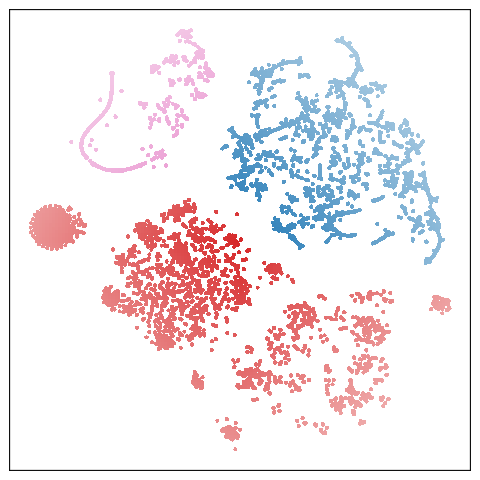 | 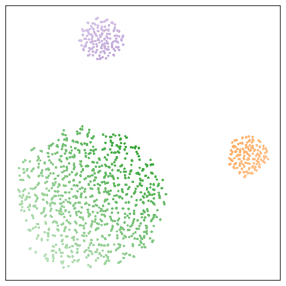 | 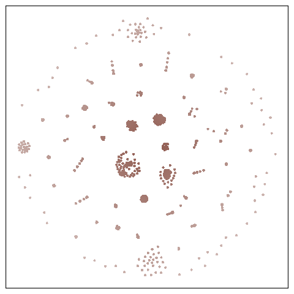 |
| MDS   |      | 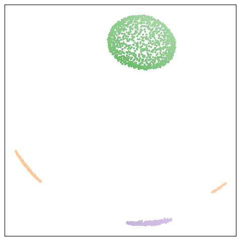  | 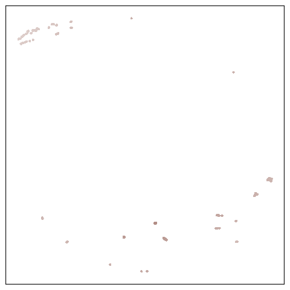  |

The violin plots of the distributions of the ground energy are as below

| 1D XYZ | 1D FH | 2D TFI | H2 | NH3 | HeH+ | Random VQE |
| ------ | ----- | ------ | -- | --- | ---- | ---------- |
|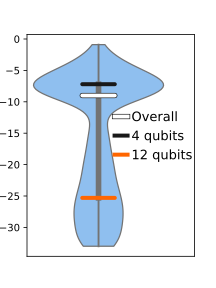|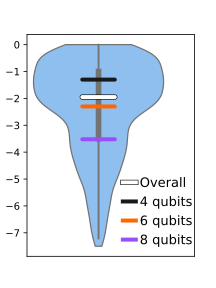|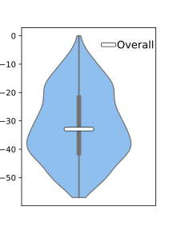|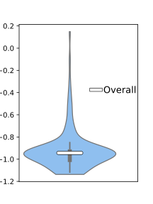|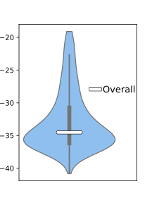|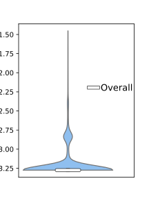|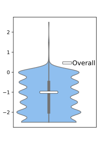|


## Usage

### Install dependencies.

The authors used [uv](https://docs.astral.sh/uv/) to manage the python environment. Make sure you have `uv` installed, via the command below

```bash
curl -LsSf https://astral.sh/uv/install.sh | sh
```

The authors curated the dataset on a Ubuntu 22.04 LTS machine, with CUDA version 12.8. To reproduce the dependencies of `VQEzy`, it is highly recommended to use a Linux machine with the same CUDA version. Otherwise the library `TorchQuantum` might have conflicts.

To install the dependencies used, first clone the repo

```bash
git clone https://github.com/chizhang24/VQEzy.git 
```

Then in the `VQEzy` folder, run

```bash
uv sync
```

to automatically install the dependencies.

### Components

The datasets are stored in 3 subfolders: `qmanybody`, `qchem` and  `qasmbench`, corresponding to applications in quantum manybody physics, quantum chemistry and random VQE application, respectively.

The subfolder `figures` contains all figures used in the paper, drawn by the `visualization.ipynb` jupyter notebook.

The `ansatz.py` script contains the definitions of all ansätze used.

The `data_samply.py` script contains all the main functions for sampling the instances in the dataset.
